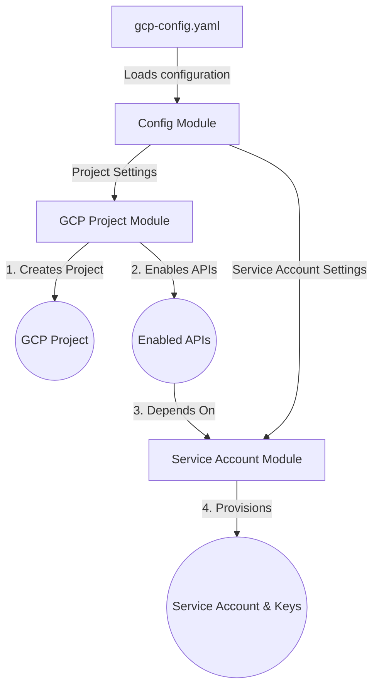

# Google Cloud Platform Modules (GCP Bootstrapper)

A plug-and-play, YAML-driven Terraform framework designed to bootstrap GCP Projects, enable essential APIs, and provision Service Accounts with specific IAM permissions out-of-the-box. 

This repository is perfect for sharing publicly: anyone can clone this project, run three simple commands, and instantly provision a clean development sandbox environment.

---

## Architecture Flow



---

## Prerequisites

Before executing Terraform, you must complete the following steps:

1. **GCP Account & Authentication**:
   You must have a GCP account. Run the following command to authenticate your local shell session:
   ```bash
   gcloud auth application-default login
   ```

2. **GCP Permissions**:
   Your authenticated GCP account must have authorization to create projects (e.g., the **Project Creator** role at the Parent Folder/Organization level, or be a billing administrator on a personal account).

---

## Getting Started

### 1. Configure Variables
Open the [gcp-config.yaml](gcp-config/gcp-config.yaml) file to define your environment parameters:

```yaml
# GCP Project & Bootstrap Configuration
create_project: true                  # Toggle to true if you want Terraform to create the project
project_id: "your-unique-project-id"   # Must be globally unique across all of GCP
project_name: "My Bootstrap Project"
billing_account: "XXXXXX-XXXXXX-XXXXXX" # (Optional but recommended for full API/resource enablement)
org_id: ""                            # (Optional) Parent GCP Organization ID
folder_id: ""                         # (Optional) Parent GCP Folder ID

# APIs to automatically enable in the project
apis_to_enable:
  - "iam.googleapis.com"
  - "compute.googleapis.com"

# Service Account Configuration
service_account_id: "gcp-service-account"
service_account_display_name: "GCP Service Account"
service_account_description: "GCP Service Account"
service_account_roles:
  - "roles/owner"
```

### 2. Run Terraform
Run the standard Terraform lifecycle commands:

```bash
# Initialize plugins and backend configuration
terraform init

# Preview the plan
terraform plan

# Apply the infrastructure
terraform apply
```

---

## Directory Structure

*   [main.tf](main.tf) - Root orchestrator tying the configuration, project bootstrap, and service account modules together.
*   [providers.tf](providers.tf) - Defines the Google Cloud provider without target project locks (essential for bootstrapping).
*   [gcp-config/](gcp-config/) - Stores the YAML files holding environment variables.
*   `modules/`
    *   [modules/gcp-config/](modules/gcp-config/) - Decodes the YAML config file.
    *   [modules/gcp-project/](modules/gcp-project/) - Handles project lifecycle & service API enablement.
    *   [modules/gcp-service-account/](modules/gcp-service-account/) - Handles IAM, service account creation, and credential keys.
